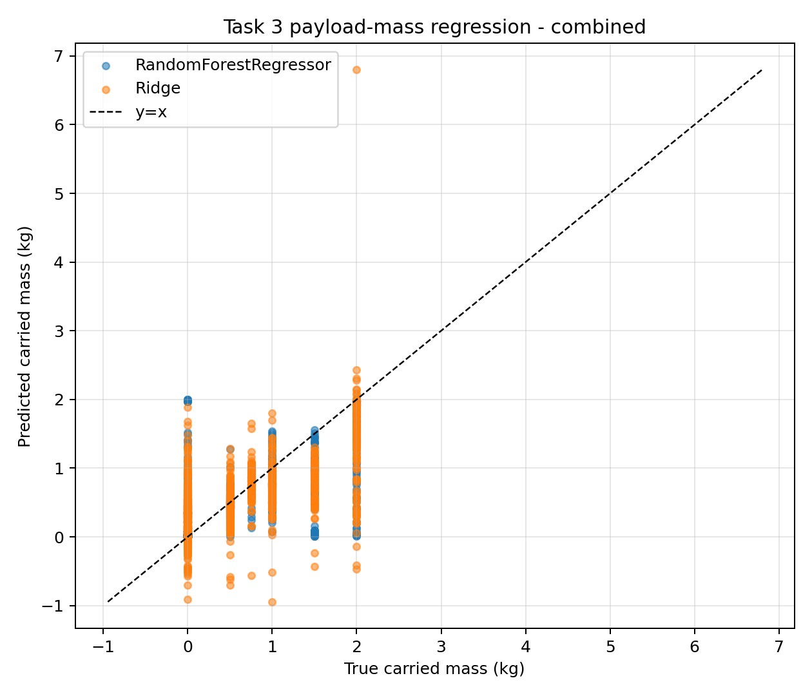
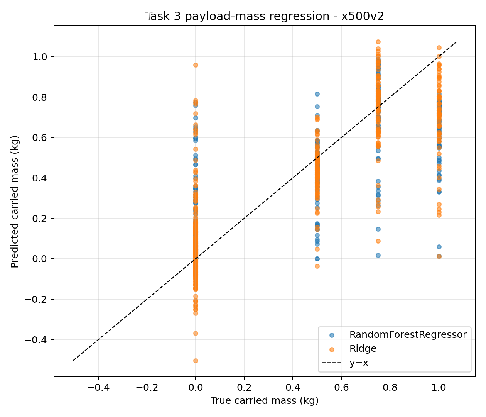
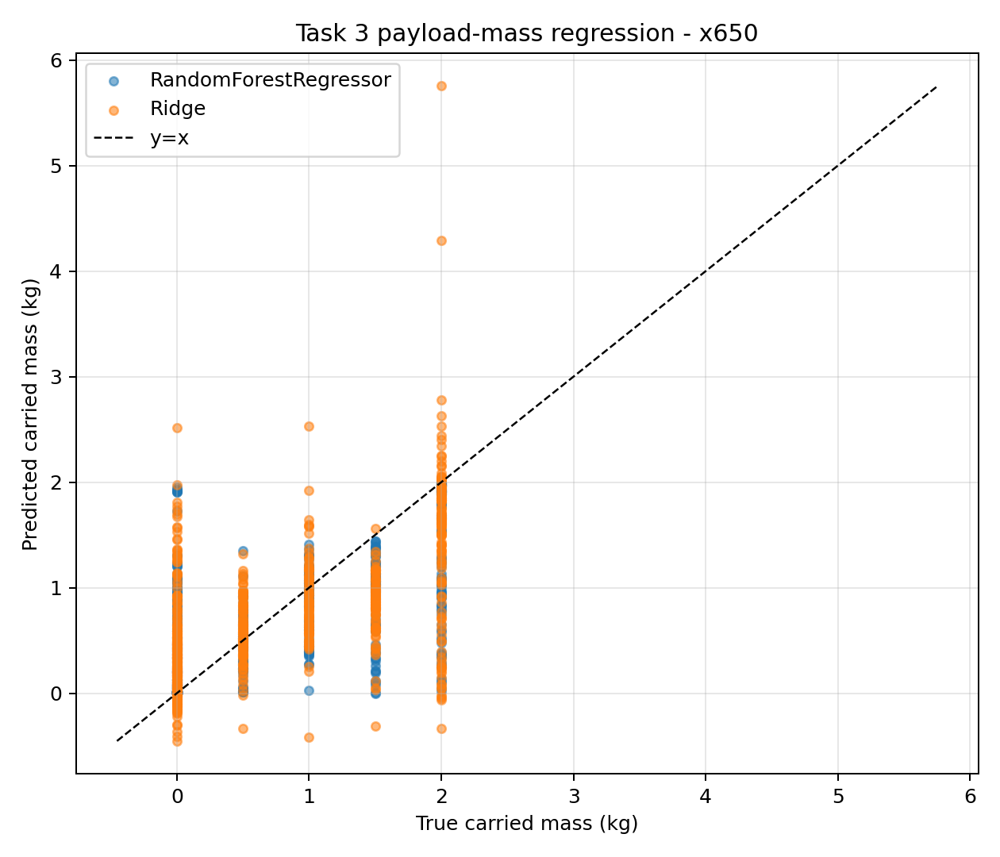
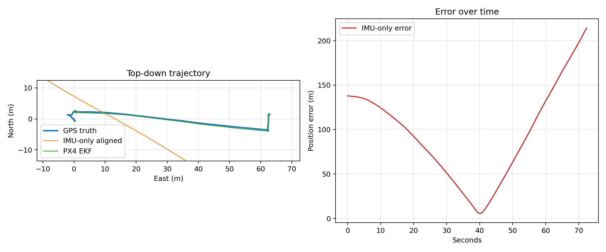
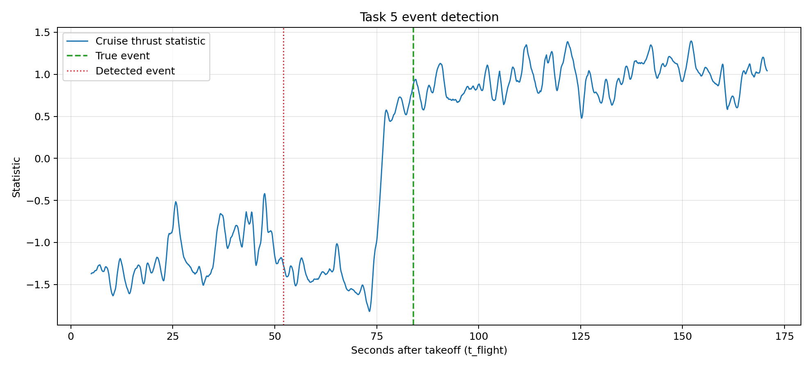
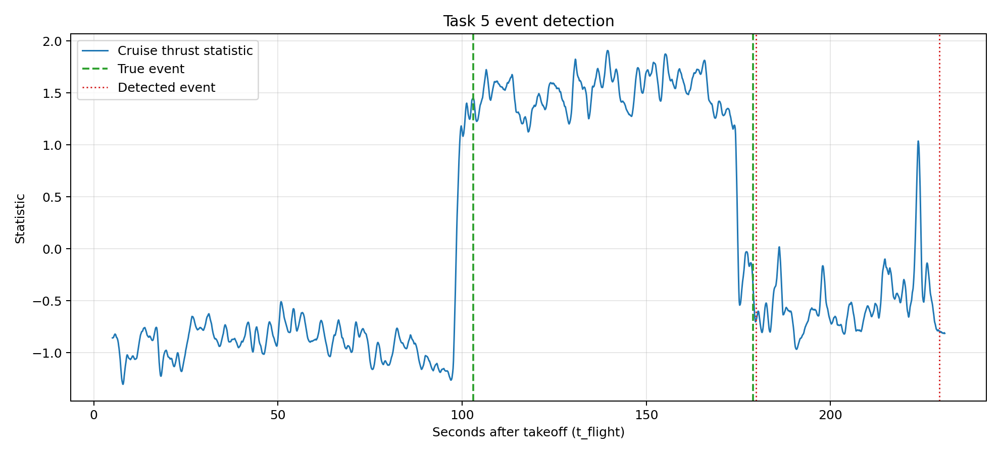

# DroneLog Devkit

Benchmark scripts for UAV flight telemetry stored as PX4 ULog (`.ulg`) files.
The devkit reads raw ULog files directly with `pyulog`; topic and field names
come from each log's schema. The scripts do not guess CSV headers or hardcode
sensor column names.

## Abstract

DroneLog Devkit provides reproducible benchmark scripts for a UAV flight
telemetry dataset recorded as PX4 ULog files. The devkit covers five task
families: frame-size classification, payload-scenario classification,
continuous payload-mass regression, navigation/odometry drift estimation, and
online pickup/drop event detection. The baseline scripts are intentionally
simple, terminal-runnable references that expose the dataset's classification,
regression, navigation, and temporal-event surfaces while preserving the native
ULog topic and field schema.

## Contributions

- ULog-native loading utilities with topic discovery, regex-based field
  matching, parquet caching, and takeoff-relative flight time.
- Two reproduced classification baselines: frame size and payload scenario.
- Three extended benchmark tasks: payload mass regression, IMU/GPS/EKF
  navigation scoring, and payload pickup/drop event detection.
- Runnable scripts, generated CSV tables, generated PNG figures, and a static
  devkit webpage in `site/index.html`.

## Install

Create a virtual environment:

```bash
python -m venv venv
```

Activate it using the command for your shell:

```bash
# macOS/Linux
source venv/bin/activate
```

```powershell
# Windows PowerShell
.\venv\Scripts\Activate.ps1
```

```bat
:: Windows Command Prompt
venv\Scripts\activate.bat
```

After activation, use `python` for the commands below. You can also run without
activation by replacing `python` with `venv/bin/python` on macOS/Linux or
`.\venv\Scripts\python.exe` on Windows.

Install dependencies:

```bash
python -m pip install -r requirements.txt
```

## Dataset Layout

The scripts recurse from `--data` and parse labels from paths:

```text
dataset_root/
  frame_size/
    250mm/ d250_1.ulg ...
    450mm/ d450_1.ulg ...
    500mm/ d500_1.ulg ...
    650mm/ d650_1.ulg ...
    680mm/ d680_1.ulg ...
  payload_detection/
    x500v2/
      0.5kg/ 1_scenario.ulg ...
      0.75kg/ 1_scenario.ulg ...
      1kg/ 1_scenario.ulg ...
    x650/
      0.5kg/ 1_scenario.ulg ...
      1kg/ 1_scenario.ulg ...
      1.5kg/ 1_scenario.ulg ...
      2kg/ 1_scenario.ulg ...
```

Frame labels come from folders like `250mm`. Payload labels come from platform,
mass, and scenario folders/files. Grouped cross-validation uses the full
relative path stem as the flight ID.

## Run Commands

```bash
python scripts/task1_frame_classification.py --data . --out outputs
python scripts/task2_payload_classification.py --data . --out outputs
python scripts/task3_mass_regression.py --data . --out outputs
python scripts/task4_navigation_odometry.py --data . --out outputs
python scripts/task5_event_detection.py --data . --out outputs
```

Every script supports:

```bash
--data <dataset_root> --out outputs/ --inspect --no-cache
```

Use `--inspect` before a full run to print topics from a sample flight and the
fields matched for that task. Missing topics or fields are reported per flight;
the scripts skip those flights and continue.

## Outputs

All outputs are written under `outputs/` by default:

- `task1_frame_results.csv`: frame-size classification accuracy, macro-F1,
  macro-precision, macro-recall, windows, groups, folds.
- `task2_payload_results.csv`: payload-scenario classification metrics.
- `task3_mass_results.csv`: payload mass regression MAE, RMSE, R2, windows,
  groups, folds.
- `task3_mass_results_x500v2.csv` and `task3_mass_results_x650.csv`:
  per-platform payload mass regression metrics.
- `task3_mass_scatter.png`: predicted-vs-true carried payload mass.
- `task3_mass_scatter_x500v2.png` and `task3_mass_scatter_x650.png`:
  per-platform predicted-vs-true carried payload mass figures.
- `task4_navigation_results.csv`: ATE-RMSE and final drift percent for IMU-only
  and PX4 EKF tracks.
- `task4_trajectory.png`: top-down trajectory and IMU-only error over time.
- `task5_event_results.csv`: pickup/drop detection latency, precision, recall,
  and counts.
- `task5_events.png`: detection statistic with true and detected events.
- `task5_diagnostic_x500v2_0.5kg_s4.png`: diagnostic event plot for the
  representative `x500v2/0.5kg/4_scenario` flight.

## Extended Benchmark Tasks

Tasks 3-5 extend the original classification baselines into regression,
navigation, and temporal event detection. All results below were regenerated
from the checked-in scripts with `python ... --data . --out outputs` after
activating the virtual environment.

### Task 3: Payload-Mass Regression

The mass benchmark estimates carried payload mass from IMU statistics and
motor-command features. The combined score is retained as a reference, but the
primary readout is per-platform because payload masses are not fully crossed
with airframe: `1.5kg` and `2kg` appear only on `x650`.

| Platform | Model | MAE (kg) | RMSE (kg) | R2 | Windows | Groups |
|---|---:|---:|---:|---:|---:|---:|
| combined | RandomForestRegressor | 0.266 | 0.462 | 0.521 | 1338 | 35 |
| combined | Ridge | 0.384 | 0.523 | 0.388 | 1338 | 35 |
| x500v2 | RandomForestRegressor | 0.117 | 0.210 | 0.701 | 564 | 15 |
| x500v2 | Ridge | 0.142 | 0.210 | 0.700 | 564 | 15 |
| x650 | RandomForestRegressor | 0.357 | 0.558 | 0.486 | 774 | 20 |
| x650 | Ridge | 0.449 | 0.631 | 0.343 | 774 | 20 |

Figures:







### Task 4: Navigation/Odometry

The navigation benchmark integrates IMU acceleration to estimate position and
scores it against independently projected GPS truth. PX4 EKF local position is
scored as a strong baseline, not as ground truth. The table reports both
per-flight median and mean values to match the paper's Table 8 and avoid
confusing the mean with the median. Raw GPS altitude is scaled from millimeters
when needed; a spot-check on `d250_1` gave raw GPS altitude median `27396` and
projected GPS vertical range `-2.98..5.07 m`, with EKF vertical RMS `0.53 m`
and horizontal RMS `0.66 m`.

| Method | Truth | ATE-RMSE median (m) | ATE-RMSE mean (m) | Final Drift median (%) | Final Drift mean (%) |
|---|---|---:|---:|---:|---:|
| IMU-only strapdown | vehicle_gps_position | 161.439 | 276.915 | 371.901 | 496.697 |
| PX4 EKF local_position | vehicle_gps_position | 0.225 | 1.233 | 0.262 | 1.537 |

Figure:



### Task 5: Pickup/Drop Event Detection

The event benchmark detects payload transitions using a cruise-only,
takeoff-relative thrust statistic. Detection is restricted to airborne cruise
to avoid takeoff/landing transients dominating the signal. The diagnostic plot
for `x500v2/0.5kg/4_scenario` places the Table 4 pickup/drop markers on the
same `t_flight` axis as the statistic.

| Method | Precision | Recall | Mean Abs. Latency (s) |
|---|---:|---:|---:|
| thresholded_derivative | 0.381 | 0.381 | 1.220 |
| ruptures_pelt | 0.452 | 0.452 | 1.499 |

Figures:





## Expected Sanity Ranges

- Task 1 should be highly separable; high frame-size classification accuracy is
  expected.
- Task 2 is intentionally hard; accuracy around `0.3` can be a correct outcome.
- Task 3 reports error in kilograms. Heavier payloads should affect hover thrust
  and dynamic response, but event timing and maneuvers make this a real
  regression problem.
- Task 4 should show IMU-only drift much larger than the EKF/GPS track. Large
  inertial drift is expected; the benchmark quantifies it.
- Task 5 should fire near annotated pickup/drop moments with modest latency, but
  the simple baseline may miss events or produce false positives.

## Limitations

- Payload mass and airframe are partially confounded. The combined Task 3 score
  can exploit platform identity because `x650` includes heavier masses not
  present on `x500v2`. Use the per-platform CSVs for the cleaner mass-dynamics
  readout.
- Task 4 uses GPS-level trajectory truth, not motion-capture or survey-grade
  ground truth. EKF-vs-GPS ATE therefore measures agreement with onboard GPS,
  not centimeter-level absolute accuracy.
- Task 5 event annotations are paper-level pickup/drop timestamps. Motor-thrust
  changes can begin a few seconds before the annotated event, so latency should
  be interpreted as detection relative to those table annotations.

## ULog-Native Design

`dronelog/io.py` provides the loading layer:

- `list_topics(path)` parses the ULog and returns available topic names.
- `load_topic(path, topic, instance=0)` returns a `pandas.DataFrame` with the
  log's real fields and `timestamp` converted from microseconds to seconds.
- `find_fields(df, patterns)` discovers fields with case-insensitive regexes.
- `find_flights(root, subset)` recurses the dataset and returns parsed labels.

`sensor_combined` accelerometer and gyro fields are located by regex so the
scripts work across PX4 schema variations. Motor-command fields are discovered
from `actuator_motors` or `actuator_outputs`.

## Cache

The first cached topic load parses the ULog and writes topic DataFrames to:

```text
.cache/<sha1-of-absolute-ulg-path>/<topic>__instanceN.parquet
```

Subsequent loads reuse parquet files if they are newer than the source ULog.
Use `--no-cache` to force a fresh parse. Clear cached parquet files with:

```bash
python -m dronelog.clear_cache
```

`pyarrow` is included in `requirements.txt` for parquet support. If parquet
support is unavailable, scripts still parse ULogs directly and warn that cache
writing is disabled.

## Frame Conventions

PX4 world frame is NED: North, East, Down. PX4 body frame is FRD: Forward,
Right, Down. Task 4 initializes attitude from `vehicle_attitude`, propagates
orientation from gyro increments with attitude correction from the logged
attitude topic, rotates body-frame specific force into NED, adds gravity
`[0, 0, 9.80665]` to recover linear acceleration, and integrates acceleration
to velocity and position. GPS is projected to local NED and used as navigation
truth; EKF local position is scored as a method.

## Webpage

A static devkit webpage is available at `https://azamatjon11.github.io/DroneLog/`. It summarizes the
five benchmark tasks, links the runnable commands, and embeds the generated
Task 3-5 figures.
